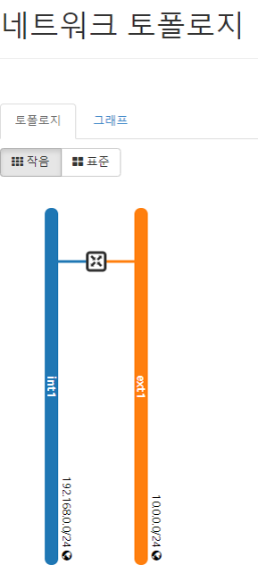
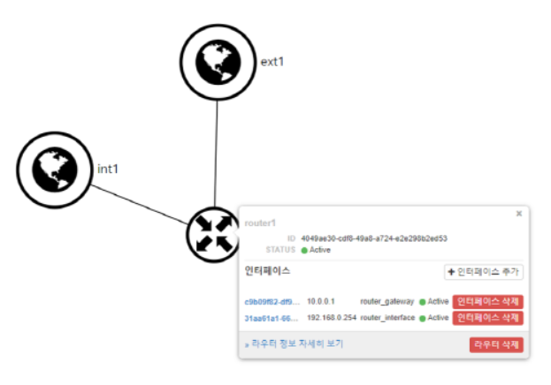

# Packstack 을 이용한 Openstack 설치

## 01. 기본 설정- 방화벽,네트워크, SElinux, Hostname 

### 방화벽 설정

1)보안 

- 방화벽: port 기반 Access 제어
  - iptaddres
  - firewalld
- **SElinux**: Label 기반 Access 제어
  - label 을 사용하는 resources ( file, dir. port ): process, 사용자
  - 사용자가 사용한 label 조회하는 법:
    - **# id -a****
    - **#ls -lZ /etc/ssh**


- 방화벽 설정 실습

  ``` cmd
  # systemctl stop firewalld
  # systemctl disable firewalld
  ```


2) NetworkManager

- 모바일(cf.server)에 최적화된 네트워크 매니저

  :각각의 모바일 환경( ex.노트북) 에 따른 profile 을 형성하여 선택 적용 가능

- 만약 서버를 NetworkManger로 관리한다면 network 구성이 불안정하다

- openstack 또한 그렇기에 openstack 을 사용하려면 NetworkManager를 꺼야한다

	 ``` cmd
	# systemctl disable NetworkManager
	# systemctl stop NetworkManager
	```


3) SElinux

> SElinux 모드를 `permissive` 모드로 변경 //일시적 변경 -다음번에 접속할 떈, 다시 해제되어 있음

setenforce

```


> check

​```cmd
# getenforce
```


> 궁극적인 변경을 위해 cofig 파일 수정
>
> ->수정 내용 SELINUX = `PERMISSIVE` 

```cmd
# vi /etc/selinux/config
SELINUX=permissive
SELINUXTYPE=targeted
```


4) Hostname

> host 파일을 편집 모드로 열고, 노드 `controller` , `compute1` 이름  추가
>
> 추가 내용
>
> >`10.0.0.100 controller` 
>
> > `10.0.0.101 compute1`

```cmd
#vi /etc/hosts
127.0.0.1   localhost localhost.localdomain localhost4 localhost4.localdomain4
::1         localhost localhost.localdomain localhost6 localhost6.localdomain6
10.0.0.100 controller
10.0.0.101 compute1
```


## 02. NTP 서버 설정 

- NTP (network time protocol)
  - 

``` cmd
//chrony config 수정

#vi /etc/chrony.conf
//추가 내용
server 2.kr.pool.ntp.org.iburst
server 127.127.1.0

//check status
[root@controller ~]# systemctl status chronyd
chronyd.service - NTP client/server

//restart system
#systemctl restart chronyd

//check source
#chronyc sources

//----<현재 상태: server 이자 client>---------------


```


## 03. Packstack 설치


``` cmd
# //openstack 과 관련된 모든 패키지 설치
# yum install -y openstack*

//openstack 매개변수 설정 파일을 저장한다.
#packstack --gen-answer-file=/root/openstack.txt
Packstack changed given value  to required value /root/.ssh/id_rsa.pub

//현재(구 버전)파일을 저장
# cp /root/openstack.txt /root/openstack.old


//openstack.txt 파일을 연다openstack 비번 및 환경 설정 수정
#vi openstack.txt
//line 번호가 보인다
:set nu 
//검색시 , 콜롬을 쓰고 라인 넘버를 치면 바로 나온다 
//ex. (press ‘i’ ) + (‘:’ + line number) +엔터
//또 다른 검색 방법: keyword 만 쓰고 엔터

```

```cmd
326 CONFIG_KEYSTONE_ADMIN_PW=abc123
11 CONFIG_DEFAULT_PASSWORD=abc123
46 CONFIG_CEILOMETER_INSTALL=n
 50 CONFIG_AODH_INSTALL=n
326 CONFIG_KEYSTONE_ADMIN_PW=abc123
873 CONFIG_NEUTRON_OVS_BRIDGE_IFACES=br-ex:ens33
1185 CONFIG_PROVISION_DEMO=n

```

```cmd
11c11
< CONFIG_DEFAULT_PASSWORD=abc123
---
> CONFIG_DEFAULT_PASSWORD=
46c46
< CONFIG_CEILOMETER_INSTALL=n
---
> CONFIG_CEILOMETER_INSTALL=y
50c50
< CONFIG_AODH_INSTALL=n
---
> CONFIG_AODH_INSTALL=y
326c326
< CONFIG_KEYSTONE_ADMIN_PW=abc123
---
> CONFIG_KEYSTONE_ADMIN_PW=33f66c98157b4ab9
873c873
< CONFIG_NEUTRON_OVS_BRIDGE_IFACES=br-ex:ens33
---
> CONFIG_NEUTRON_OVS_BRIDGE_IFACES=
1185c1185
< CONFIG_PROVISION_DEMO=n
---
> CONFIG_PROVISION_DEMO=y

```


[root@controller ~]# packstack --gen-answer-file=/root/openstack.txtPackstack changed given value to required value /root/.ssh/id_rsa.pub

[root@controller ~]# cp /root/openstack.oldcp: missing destination file operand after `/root/openstack.old'Try 'cp --help' for more information.

[root@controller ~]# cp /root/openstack.txt /root/openstack.old

[root@controller ~]# vi openstack.txt

[root@controller ~]# diff /root/openstack.txt /root/openstack.old11c11

``` cmd
[root@controller ~]# time packstack --answer-file=/root/openstack.txt
Welcome to the Packstack setup utility

The installation log file is available at: /var/tmp/packstack/20200108-141156-g5eUyu/openstack-setup.log

Installing:
Clean Up                                             [ DONE ]
:
:
complete!
```


## 04. Dashboard 기능-소개

### 4.0 Openstack 용어

- `프로젝트` :  **cloud** **사용자** group 에 **Quata** 적용
- Tenant : cloud 사용자 그룹 (project 별)
- Flaver : VM profile
- Image : Instance 에 연결될 OS 설치 이미지
- Instance - VM
- Key pair - DER/PEM/X,509 로 인코딩된 넷스케이프 인증서
  - 사용자가 VM instance 에 접속시 사용

### 4.1 Horizon 서비스 실습

@admin 계정 

1.1 프로젝트 생성 -pro1  

1.2 사용자 생성 -stack1, mgr1  

1.3 flavor 생성 -a.tiny, a.nano

@사용자(_member_) 계정 : self-service

1.4 network 생성

1.5 router 생성

1.6 security group 생성

1.7 keypair 생성

1.8 floating ip 생성


#### (admin) project 생성

A. project "pro1" 생성

B. project member 추가 

- admin : admin 
-  _member_ : member

C. project quotas 수정

- 인스턴스 : 5	
- VCPUs : 5 


#### (admin) 사용자 생성

A. stack1 (_member_) 사용자 생성

B. mgr1 (admin) 사용자 생성


#### (admin) flavor 생성

A. a.tiny 생성

B. a.tiny 생성


---------<openstack 과 aws 의 용어와 개념은 비슷하다>-------------------------------------

@aws

- 'default' 라는 VPC 라는 가상 네트워크가 기본으로 주어짐

- default VPC 의 속성

  - public network

  - ex1 (외부 네트워크가 있음) : 외부망(internet) 과 바로 붙을 수 있음

  - 'subext1'이라는 subnet 이 있음 : 10.0.0.0/24 로 지정 (물리 network 주소 : 공인 IP)

    > 현재 실습에서 사용하는 우리의 GW: 10.0.0.2 ( =DNS)

- 인스턴스 

  - fixed IP :사설 IP 

  - floating IP (공인 IP) : EIP (Elastic IP) 를 요청

    1) AWS DASHBOARD에서 EIP 를 요청

    2) ip 주소가 요청되면 public IPv4 가 할당된다

    > 현재 **IPv4** 의 주소는 **유한한 자원**이기 떄문에, **할당 o , but 사용x** 이라면 **과금 부여****

  

  <u>*그래서!!!! **instance type** @aws = **flaver** @openstack</u>


#### (stack1, mgr1) network & router

- Floating IP용: ext1->subext1->10.0.0.0/24,gw: 10.0.0.2, dns:10.0.0.2,dhcp X, 사용 IP pool(10.0.0.210,10.0.0.220),외부네트워크

- Fixed IP 용: int1->subint1->192.168.0.0/24,gw:192.168.0.254,dns:10.0.0.2,dhcp 활성화)router1 생성

  

- 외부 네트워크과 router간 연결: 게이트웨이 설정

- 내부 네트워크와 router간 연결: 인터페이스 추가

 <최종 연결 내용>




