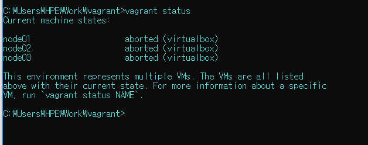
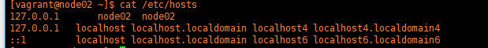
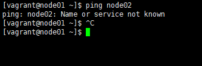
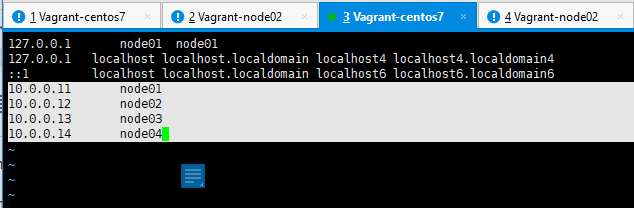
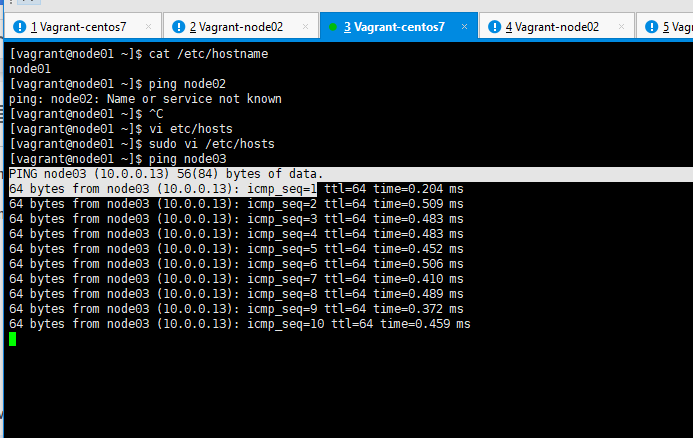

# MongoDB on Vagrant

## 1. MongoDB 실행 @Windows

### @windows, IP & port Info:

- 기본 IP: 127.0.0.1 

- mongoDB 기본 Port : 27017

- mongoDB node01 Port: 27018

- mongoDB node02 Port: 27019

- mongoDB node03 Port: 27020

- mongoDB node04 Port: 27030

  

### ex.node01 case

(node02, node03, arbiter 모두 동일)

**@Work/mongodb-4.2.2>**

-mongodb node01 서버실행

``` cmd
>mongod --dbpath .\data\node01 --port 27018 --replSet myapp;
```


-mongodb node01 클라이언트실행 

``` cmd
//host IP 와 port 번호으로 명시
>mongo --host 127.0.0.1 --port 27018

----<mongodb 명령어 활성화>---------

// master, slave, 현재위치를 알수 있다
>db.isMaster();
```


### MongoDB 기본 명령어 테스트

**@Work/mongodb-4.2.2>**

(M)

``` 
>show bds;
>use bookstore;
>show collections;
{#생략가능->  db.createCollection("books");
}
//값 생성 및 저장
>db.books.save({title:"MongoDB basic"});
//조회
>db.books.find();
```


(S)

``` CMD
//check slave status
// Ok : 'O' is CAPITAL
>rs.slaveOk();
>show dbs;
>use bookstore;
//table 검색
>show collections;
// 값 (레코드) 조회
>db.books.find();

```


## Vagrant 실행

-Vagrant를 실행하여 모든 node들이 활성화 되었는지 확인한다.

**@Work\vagrant>**

``` 층
// check status
>vagrant status

//update status
>vagrant up
```




## ReplicaSets -MongoDB 복제 시스템

### CAP 이론

-CAP 이론 정리

-CAP 이론의 3가지 요소 :

**적어도 2가지 요소를 만족**하며  나머지 요소를 만족한다면 최고의 상태

- 일관성

- 가용성

- 분단 허용성

ex. mongodb: cp 카테고리( 일관성 & 분단 허용성 보장)

### Arbiter Member 유형

- Master - Slave 구조로 구성된다.( 또는 Primary - Secondary)

- 데이터 복구를 위해 백업 서버를 두기위해 사용되는 시스템

- 데이터 복제 동기화

- 여기서는 1 Primary , 2 Secondary, 1 Arbiter 의 구성 유형으로 진행

- Arbiter Member

  :data 를 저장하지 않으며, 장애 발생 시 Primary server 를 선출하기 위한 election 에만 사용됨

- 구동 방식

  1. 서버(node)는 서로의 상태를 확인한다.(hearbeat 전송)

  2. `master` 서버가 죽었다면(비활성화 상태), Arbiter 서버가 새로운 Master 서버를 선출한다.

  3. 기존 master 서버의 backup data를 새로운 master 로 복제하여 운영한다.

     

# 2. MongoDB 실행 @CentOS

## CentOS 환경,Vagrant 로 mongdb 설치하기

``` Linux
$sudo yum -y update

### MongoDB 4.0 저장소 메타 정보 생성
$sudo touch /etc/yum.repos.d/mongodb-org.repo
$sudo bash -c 'echo "[mongodb-org-4.0]" >> /etc/yum.repos.d/mongodb-org.repo'
$sudo bash -c 'echo "name=MongoDB Repository" >> /etc/yum.repos.d/mongodb-org.repo'
$sudo bash -c 'echo "baseurl=https://repo.mongodb.org/yum/redhat/7/mongodb-org/4.0/x86_64/" >> /etc/yum.repos.d/mongodb-org.repo'
$sudo bash -c 'echo "gpgcheck=1" >> /etc/yum.repos.d/mongodb-org.repo'
$sudo bash -c 'echo "enabled=1" >> /etc/yum.repos.d/mongodb-org.repo'
$sudo bash -c 'echo "gpgkey=https://www.mongodb.org/static/pgp/server-4.0.asc" >> /etc/yum.repos.d/mongodb-org.repo'

### MongoDB 4.0 설치
$sudo yum install -y mongodb-org

### 환경 설정
$sudo vi /etc/mongod.conf
net:
  port: 27017
  ### 내부망에 연결된 모든 노드로부터의 원격 접속을 허용
  ### 개발 및 테스트 환경에서만 사용, 운영 환경에서는 보안 문제로 비추천
  bindIp: 0.0.0.0
```


-vagrantfile 수정

**@Work\vagrant\vagrantfile>** (vs code 편집기로 open)

``` cmd
##node01 설정 추가
cfg.vm.network "private_network", ip: "10.0.0.11"
cfg.vm.network "forwarded_port", guest: 27017, host: 27017

##node02 설정 추가
cfg.vm.network "private_network", ip: "10.0.0.12"
cfg.vm.network "forwarded_port", guest: 27017, host: 27018

##node03 설정 추가
cfg.vm.network "private_network", ip: "10.0.0.13"
cfg.vm.network "forwarded_port", guest: 27017, host: 27019

```


-vagrant halt and reboot

**@Work\vagrant>**

``` 
>vagrant halt
>vagrant up
```


## CentOS 환경에서 vagrant-node01, node02, node03 간 연결

**@vagrant-node01 cmd 창**

> ***linux 환경에서는 역슬래시( `\` )가 아니라 슬래시( `/` ) 를 사용한다******

``` linux
//check the server name
cat /etc/hostname
node01

//check the IP and hostname
cat /etc/hosts

```

**before)** 아래와 같이 매치가 되지 않는다( ip 주소와 node 이름)







``` linux
//해당 내용 추가하여 수정완료
vi etc/hosts
```

@node01, node02, node03 cmd 창에서 모두 진행 (**총 수정 파일 3개**)

**추가한 내용)**

**10.0.0.11    node01** 

**10.0.0.12    node02**

**10.0.0.13    node03**

**10.0.0.14    node04**




``` linux 
//node01 cmd 창에서 node02과 연결시킨다
//원래는 'node02' 이라서 '10.0.0.12' 와 같은 전체 IP를 작성해야했다
ping node02
```


**after** ) 아래와 같이 매치가 된다(IP 주소와 node 이름)




